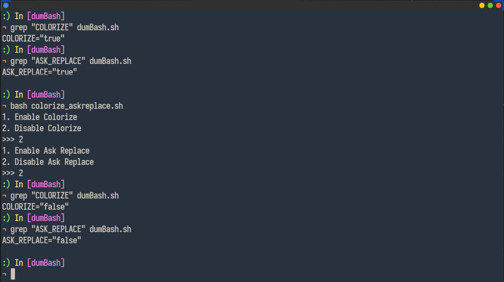

<p align="center">
    
</p>
<p align="center">
    😦 Replace your second keyboard layout characters to English in bash. (Persian)
</p>

## Installation
1. Download `dumBash.sh`:
```
$ git clone https://github.com/MahdyMirzade/dumBash.git ~/dumBash
$ cd ~/dumBash
$ bash setup.sh
```
2. Restart terminal or bash.

## Configuration
Run `config.sh` script:
```
$ cd ~/dumBash
$ bash config.sh
```


## Donate
<a href="https://raw.githubusercontent.com/mahdymirzade/mahdymirzade/main/assets/dotfiles/heart.gif"></a>
I put some time on this project and I really don't think it has any values but I would love some cryptocurrencies:
- **BTC:** `1H5YUVVif9u9JNBVaboCwsBvHAoDeAW5yc`
- **ETH:** `0x05A11A118eb3BDbD015c2fdd3F843dBe422C2955`
- **LTC:** `LiZRqXUrQYjs8TapBEpEngiSiZMvViaPhi`
- **ZEC:** `t1NRoc1a6nXxZT1c1dDCUaMTGGRcpfCBcXy`

Made with <3 by **Mahdy Mirzade**

Yell at me: [me@mahdym.ir](mailto:me@mahdym.ir)
